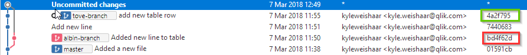
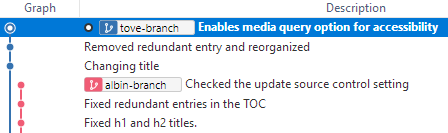

# Conflicts

Merge conflicts can happen when:

1. You merge changes where a document(s) are in conflict.
1. Edit a file that as been deleted.

Sometimes, things can become messy when many people are working on the same stuff. Fixing conflicts is pretty easy though, especially with the right tools.

On a single branch, each subsequent commit replaces the previous.

```ascii
A---B---C---D ... (feature-a)
```

When you merge, conflicts can happen.

```ascii
A---B---C---G (feature-a-albin)
\          /
 D---E----F (feature-a-tove)
```

If the same file has changed on both branches, which version, F or C, is correct when you merge to create G?

## Conflicts with Sourcetree

Let's say we have two writers, Albin and Tove, and they are working together on a new product scenario. They both edit the same file, and there is a conflict when one of them merges the two branches.

|Tove change|Albin Change   |
|---        |---            |
|||

Let's say that Tove wants to merge Albin's branch with hers. When Tove clicks **Merge**, she sees a merge conflict error. There are several ways to solve the conflict.

### Simple resolution using Mine vs. Theirs

Click the file and look at the File diff window.


The conflict is highlighted by angle brackets (<,>) and the the two conflicts are separated by equal signs (=).

Tove can choose which change to keep using the `mine` or `theirs` method.

1. Right-click the staged file.
1. Select **Resolve Conflicts**.
    A dialog opens.

    

1. Select **Resolve Using 'Mine'** to keep the current branch version.

     (or) Select **Resolve Using 'Theirs'** to keep the other version.

     Let's keep Albin's version for this example.

!!! Tip
    If you can't remember which resolution method to use, don't worry! When you select either option, a dialog opens before resolving the conflict asking you if you want to keep the file from commit number X.

    

    

    You can verify the commit you want to keep by using the hash. We can see Albin's version is from commit `bd4f62d`.

1. Select **OK**.

    You'll see a merge commit in the Sourcetree graph that is uncommited.

1. Select **Commit** from the ribbon.
1. Enter a merge commit message.

    There will be some auto-generated message about the conflict resolution.

The conflict is resolved. You can now safely delete unused branches.

### Using an external merge tool

Solving a conflict might not always be as easy as picking mine or theirs. Sometimes you'll need to customize the merge. This is also easy with a simple text editor.

Let's go through a complex and likely scenario.

* Both Albin and Tove are working on a DataMarket feature.
* They both create a feature branch.
* They both change the same file.
* They update the TOC.
* They update the target.

When they merge, they will have several conflicts, possibly in `htm` files, and in `fltoc` and `fltar` files.

Let's look at where our writers are at.



Each writer branch has its own commit history.

Let's say that Tove is responsible for delivering this feature, so she merges Albin's branch with hers. The TOC does not produce a conflict even though they both changed it. This is because each other's changes do not conflict with the other.

When Tove clicks on the conflict target file, she sees exactly what is conflicting.

#### Fixing the target conflict


The change in the green box is not in conflict (there are no conflict characters <,>,=).

The first red box shows that the stylesheet was changed on both branches. The second red box shows a new line `UseDeviceWidth ="true"`.

??? Info
    You can't solve this merge conflict in Flare and you might see an error message in Flare when you get a merge conflict. You can just close it.

Since target files are mostly just config settings or text fields, using a `mine` or `theirs` strategy will work for solving these types of errors, since you'll never want to combine changes. But, to make this example more complicated than it needs to be, I'll choose one of changes from each branch which will force me to use an external tool.

* I want to use the common_print.css stylesheet
* I want to use the device width setting.

The best option is to open the file in a text editor and make the change manually.

??? Tip
    See [Set up Custom Actions in Sourcetree](custom-action.md) to link a text editor to your custom actions.

Tove opens the file in VS Code.


With VS Code, Tove selects which changes to keep and then saves the file. She goes back to Sourcetree. The target conflicts are gone.

#### Fixing the htm conflict

Tove will fix the htm file in the exact same way. She opens the file in VS Code. She select which changes to keep. She saves the file, and then she goes back to Sourcetree.

#### Finishing the commit

Tove still has the same files in both _staged_ and _unstaged_ areas. She needs to clean up before the commit.

1. Select **Stage All**.

    The _unstaged_ files will disappear.

1. Select **Commit** from the ribbon.

Tove will build locally and verify the changes before deleting unused branches.

#### Fringe case: deleted files

Tove deleted a file called New Text Document. Albin didn't know and was editing this document on his branch. When Tove merged Albin's branch, there was a merge conflict for the deleted file.

Sourcetree will not show a conflict in file diff area because a diff requires two files. Currently there is only a file on `albin-branch`. Tove cannot resolve using a `mine`-`theirs` strategy because the file does not exist. If she selects `mine` (meaning hers), Sourcetree throws an error.

Assuming there are other changes on Albin's branch that Tove wants to keep, she will right-click the deleted file and select **Remove**. This should remove it from all file areas in Sourcetree.

Tove can now commit the remaing changes and merge.

## Conflicts with Git Bash

??? Recommendation
    Read the Sourcetree example which goes into more detail about the conflicts. The GUI will help you visuzalize what is happening with a conflict.

Let's say I `git push` and I get an error like the following:

```bash
git push
To https://github.com/qlik-trial/omni-project.git
 ! [rejected]          new-branch -> new-branch (fetch first)
error: failed to push some refs to 'https://github.com/qlik-trial/omni-project.git'
hint: Updates were rejected because the remote contains work that you do
hint: not have locally. This is usually caused by another repository pushing
hint: to the same ref. You may want to first integrate the remote changes
hint: (e.g., 'git pull ...') before pushing again.
hint: See the 'Note about fast-forwards' in 'git push --help' for details.
```

Git is saying that I can't `push` because the remote copy of the branch has diverged -- it has content that I don't have on my local branch. It is also telling me that I need to `fetch` first. So let's do that.

What we want to do is:

1. Fetch the changes from remote.
2. Merge those changes with local.
3. Push our changes to remote.

```bash
git fetch
git merge
git push
```

If the changes that someone else pushed to the remote branch are not in conflict with your changes, this process will move seamlessly.

### When conflicts need fixing

Let's say another writer working on `new-branch` changed the title of a document and then pushed her changes to the remote branch. Meanwhile, you also changed the title of that same document on your copy of `new-branch`. When you `git push` your changes to remote, you see a conflict error as above. So you try the `fetch`, `merge`, `push`. The real problem comes when you run `merge`:

```bash
git fetch
git merge
Auto-merging docs/<your-document>.htm
CONFLICT (content): Merge conflict in docs/<your-document>.htm
Automatic merge failed; fix conflicts and then commit the result.
```

Git won't let you merge because you'd be changing the other writer's commit. So, how do you proceed?

Well, you want to see the conflict and decide what to do. The simplest solution is to use a text editor like VS Code (or Atom, Notepad++, Sublime, etc.) to see te changes.

1. Open the conflict document (\<your-document\>.htm) in a text editor.
2. The conflict should be indicated:
    ```markdown
    <<<<<<< HEAD (Current Change)
    # Pushing and Pulling
    =======
    # Pushing and Pulling example
    >>>>>>> refs/remotes/origin/new-branch (Incoming Change)
    ```
    Current change is your version. Incoming change is the remote version. Here we can see the conflict: both writers made changes to       the title.
3. Correct the change by deleting the \<,\>,=, HEAD, and the content that you don't want to keep, or integrate both changes.
    I want to keep the current change so my document will look like this:
    ```markdown
    # Pushing and Pulling
    ```

Now, we need to `stage`, `commit`, and `push`.

```bash
git add --all #--all just means stage any and all changed files
git commit -m "fixed conflicts"
git push
git show-ref new-branch
ebca4258650049a273e9a67b3fb9aad8aa70af22 refs/heads/new-branch
ebca4258650049a273e9a67b3fb9aad8aa70af22 refs/remotes/origin/new-branch
```

Now we can see that the remote and local branches are up-to-date and pointing to the same commit. And that is what we want.