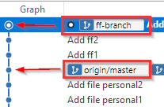
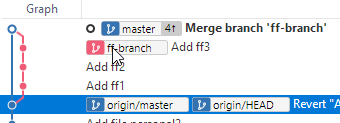

# Fast Forward Merge with Sourcetree

A fast forward merge is like a rebase, but it is specific to a scenario where there have been no commits to the original branch since the time you branched off of it.

```ascii
    B--C--D (ff-branch)
   /
  A (master)
```

There are three commits on `ff-branch`, but there are no new commits on `master` since `ff-branch` branched off. This is when a fast-forward merge happens.

In Sourcetree, the graph is a bit confusing because we expect a branch to "branch" off of a commit, but this is only the case when two branches diverge.



`master` points to a commit, and `ff-branch` points to a different commit. However, `master` does not have any commits that `ff-branch` does not have.

## Force merge

In the above situation, when you merge `ff-branch` into `master`, the `master` pointer just moves up the graph, leaving each commit in its linear order.

We can force a true merge, which creates a new commit that has two parents, by selecting the **Create new commit even in fast-forward** is possible.


The resulting graph shows what happens.

.

The latest commit has one parent commit from the `ff-branch` and one from `master`.

This option is useful when you want to preserve the true history of branches, even when a fast-forward is possible.