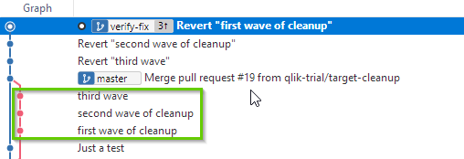
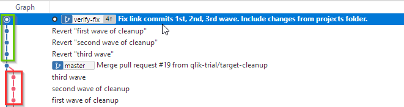
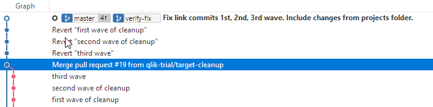

# Reversing Commits with Sourcetree

This example is taken from the `omni-project` trial.

## Scenario

We had three commits that need to be reversed but not every single file change that was part of the commit should be reversed.
Everything was committed to `master`.

The three commits happened one after the other: "third wave", "second wave", "third wave".

Each commit contained a whole lot of changes. Most of the changes in these three commits were changes to links. It turns out that the changes we made won't work, but we want to keep the non-link changes.

## Solution

??? Info
    There are probably many solutions.

I create a branch called `verify-fix` that is just a copy of `master`. Then I `git reverse commit` the three commits that I don't want. [Reverse commit](revert-gitExt.md) is a safe operation because it create a new commit that does not include the changes from the commit that I want to exclude.

You can see above, the three commits on `verify-fix` has three reverse commits. Now, it does not have the same commit history as `master`.

Now I want to re-add some of the files from those commits to my `verify-fix` branch.

To add file changes from the commits I reverted, do the following:

1. Select one of the commits.
1. Select the file/change that you want to stage.
1. Right-click the file.
1. Select **Reset to Commit**.

    ??? Tip
        The icons beside each file show you want type of change it is.

1. When finished, select the **uncommitted changes**, write a commit message and commit.

### Result

 

I reversed the full commits I didn't want, and then I made a new commit and added the changed files from the reversed commits that I did want.

## Merge

1. Checkout `master`.
1. Click **Pull** to make sure I have the latest `master`.
1. Click **Merge**.
1. Select the commit I want to merge into `master`.

    This is my latest commit on `verify-fix`.

1. Click **OK**.

### Result

Since there were no other changes to `master`, git did a [fast-forward merge](ff-sourcetree.md).

The last step is to push the changes to origin and to delete my branch if it is done.
