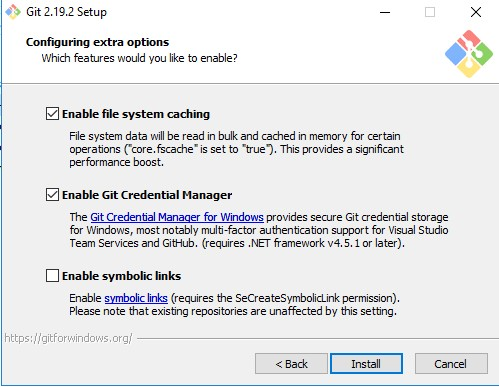

# Install Git and Git Extensions

The first thing you should download is git. Git is a small version control program that we use to store our help documentation.

## Git

You can download Git from the [Git Download](https://git-scm.com/download/win) site.

The installer includes:

- Git
- Git bash (CLI for Git)

!!! Reminder
    You may have missed it on the home page, but you need to request access to the private Qlik repos. See the [For new writers section](./index.md#for-new-writers).

### During setup

Make the following selections

Then also select:

1. Vim as Git's editor. If you plan on using Git Extension this option is not really important.
2. **Use Git from Git Bash only** when adjusting your path environment.
3. **Use Native Window Secure channel library**
4. **Checkout Windows style, commit Unix Style line ending** (it's the first option on top)
5. **Use Windows default console window**

You should also enable the following options:

## Git Extensions

Git Extensions is a powerful open-source git GUI and toolkit. If you want to avoid using the command-line,
we recommend that you install Git Extensions.

1. Grab the latest release of Git Extensions [here](https://github.com/gitextensions/gitextensions/releases).

    At time of writing, the latest release is v2.51.05.
    Scroll to the bottom of the page. You should see a download button with the version number.

2. Run the installer.

3. Accept the default install location.

4. In the custom setup dialog, select the *PuTTY* option for better integration with Windows.

5. Select **Install**.

    Windows User Account Control will halt your installation. Watch for the blinking icon in your taskbar
    which indicates Windows is asking for you to confirm the installation.

    !!! Note
        The first time you open Git Extension, the app will verify that your machine is set up correctly.
        Click **OK** to open the app.
		
!!! Recommendation
    We recommend installing *Meld* as your conflict solving tool instead of KDiff.