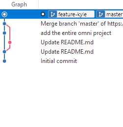

# Rebase with Sourcetree

Rebasing is similar to a merge in that you are taking commits from one branching and applying them to another branch. However, rebasing applies the commits from one branch to another branch in a linear order.

## Explanation

Here we have two branches: `master` and `rebase`.

```ascii
    A--B--C (rebase)
   /
  D--E--F (master)
```

When you merge `rebase` into `master`, commit G is the result of merge. Commit G has two parents, C and F. You can think of this as 'the state of `master` at commit G is the combination of commit C and commit F.

```ascii
    A--B--C (rebase)
   /       \
  D--E--F---G (master)
```

When you rebase, you are applying the commits from `rebase` to `master` in a linear order. Commit A is applied first, followed by B, then by C.

```ascii
             A--B--C (rebase)(master)
            /
  D--E--F---
```

## Example

Let's say I have two branches. I want to rebase the `rebase` branch onto `personal` -- I want to take the commits from `rebase` and place them in linear order on the `personal` branch.


`rebase` has two commits that are not on `personal`.

1. Checkout `personal`.

    ??? Info
        I need checkout the branch I want to merge/rebase into.

1. Click **Merge** from the ribbon.
1. Pick the last commit on `rebase`.
1. Select **Rebase instead of merge**.

    

    ??? Warning
        If the changes from `rebase` are already pushed to the remote, then rebasing now will cause a merge conflict. You should only rebase locally, and only before you push changes to the remote. Else, you will end up with a merge conflict.

After rebase, the graph now shows a linear commit history rather than a commit merge history.

???Info
    c.f with the merge graph.

|Rebase|Merge|
|---    |---    |
| | |

I can delete `rebase` if it is no longer needed. To bring master up-to-date, I can merge `personal` into `master`. The result is a linear commit history on `master`.

Rebasing is a good for when you want to keep the commit history when merging.
