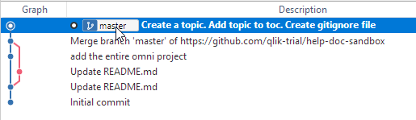

# Step 1 - Create, Add, Commit, Push

Let's do a quick task that follows the centralized workflow. This will help you familiarize with the basic operations.

A centralized workflow is more or less what we did with TFS.

## Exercise

Let's say that we only have a single branch called `master` (you might see other branches but ignore them for now). This branch is on the GitHub server and on your local machine. This workflow involves making changes locally and pushing them to the remote.

Open Sourcetree and look at your left-hand menu. It should show a master branch under **Branches**.

Do the following:

??? Info
    If there are other branches, make sure you are checkout on `master`. Master should be bold and have a circle beside it.

1. Open the omni-project in Flare (c/git/help-doc-sandbox) and create a new topic inside the `test-writers` folder. Name it "<your-name-test\>". It does not matter its content so just use a sample template or copy from another topic.
1. Add the new topic to the toc `test-writers-toc`.
1. Open Sourcetree. Notice that Sourcetree placed the two files that you changed in the file staging area.

    * You'll see an **uncommitted changes** at the top of the graph.
    * I've staged one file to show the unstaged and staged areas, but to stage a file you need to select it and stage it. 

    ??? Tip
        Remember, files are one of three states: unstaged, staged, committed. When a file is new, git has not yet added it to the index so there can be no preview. Once you stage a new file, it is added to the index and you can preview the changes in the file content pane.

    

1. Stage all your files. (You sould have the topic and the toc).
1. Commit your files with a message.
1. Do a `git pull`.

    ??? Tip
        When working in a repo with lots of contributors, you should _always_ pull before you push. This ensures that your copy of master is the latest. See [Branching Best Practices](best-practice-branch.md).
        
1. Push your commit to remote.

    ??? Info
        You can select the checkbox that will push automatically with commit.

1. Check the graph.

    

    ??? Info
        If you have the option **Show Remote Branches** selected, you'll see two more labels on the graph: `origin/master` and `origin\HEAD`.

## Look around

You can click on commits in the Sourcetree graph to see the files and changes associated with each commit. Notice that comments can be very helpful when searching history.

### For fun

You can open a previous version of a file. 

1. Highlight a commit in the graph (not the latest).
1. Right-click on one of the files and select open previous version.

    You'll notice that the file name is just a tempXXX number.

If you do this with an .htm file, it will open in your browser.