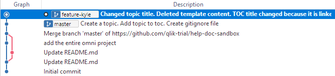
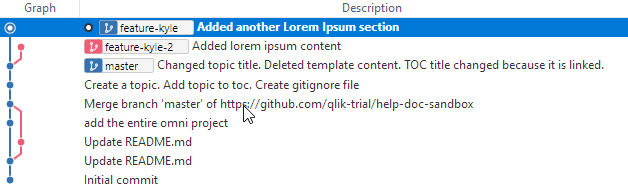
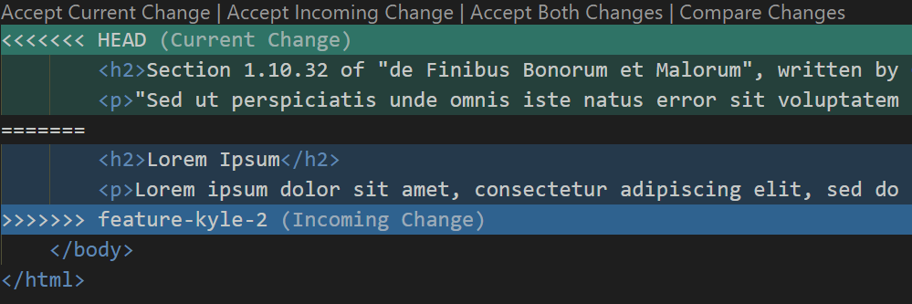

# Step 2 - Branch, Add, Commit, Merge

Let's make a branch! Branches are cheap and easy to make with git. In a system like TFS, branches are expensive, timely, and heavy. Why? Because a TFS branch is a copy of every single file in a branch. 100MB becomes 200MB.

??? Recommendation
    [Git is Simpler Than You Think](http://nfarina.com/post/9868516270/git-is-simpler)

## Exercise 1 - Branch and merge

Let's assume that the repo hasn't changed since the end of step 1.

We have one branch `master`. We will branch off of the latest commit on `master`.

Do the following:

1. Create a branch from `master` and name it `feature-<name>`. If you need a reminder on how to branch, see [Create a Branch with Sourcetree](branching_gitExt.md). I created a branch called `feature-kyle`.

    

    You should see it pointing to the same commit as `master`.

    ??? Info
        Remember, a branch is just a pointer to a commit, and our new branch points to the same commit as `master`. This is why branches are cheap. Git does not create redundant files etc.

    Notice that the branch that is checked out is the new branch. This means any changes to files in my working directory are on this branch.

1. Open up the file you created in the last exercise and change the title and/or make some other changes.
1. Go back to Sourcetree. You'll see **uncommitted changes** at the top of the graph.
1. Commit the changes with a good commit message. If you see the TOC in the staged files, that is because the TOC entry is an xref link, so when you changed the title, the toc was also updated. Git picks up this change and puts your changed files in the staging area.

    ??? Info
        Make sure you do not push the changes to the remote. We did not setup remote tracking when we created this new branch so it only exists on your local machine.

    

Your branch is now 1 commit ahead of `master`. Let's say the feature work is done and we want to merge our feature to `master`.

Do the following:

1. Checkout `master`.
1. Click **Merge** from the ribbon.
1. Select the commit latest commit of your branch.
1. Leave the default settings.

    

    ??? Info
        Remember, there were no other changes on `master`, so it does a fast-forward merge, which means `master` just moves to the latest commit.

The **Push** button indicates that you that the local `master` is ahead of the remote `master`. So go ahead and push!

## Exercise 2 - Fix merge conflict

Let's continue with a more complex example.

??? Info
    What I did for this example:
    I added an <h2\> and a <p\> following the header. I did this for the same file on both branches. Next, I will merge the two branches. This will produce a merge conflict since both branches have changes in the same spot in the file.

Do the following:

1. Create another branch from master. Call it `feature-<name>-2`.
1. Check out the new branch.
1. Open your topic and add some Lorem Ipsum content.
1. Stage and commit this change to your current feature branch.
1. Checkout `feature-<name>` and repeat steps 3 and 4.

    ??? Info
        Notice that when you switch your branch, the changes you made to the topic on the other branch are no longer there. When you checkout a different branch, Git rebuilds the working directory based on that branch (which does not have the changes you just made).

    

    We can see that from the commit that `master` points to, there are two branches for the feature branches. Three branches, all started from the same point, now all pointing to different commits. The topic file is different on each branch. `master` has the original version, the other two branches have different additions to the same topic. This could happen if two writers are working on the same file (feature files, TOCs, targets, etc.).

1. Click **Merge** from the ribbon (we are still checkout on `feature-<name>`).
1. Select the latest commit from the other feature branch (`feature-<name>-2`) to merge into your current branch.
1. You should get a merge conflict, so select OK when the message pops up.

    Sourcetree will look like this: the file with the merge conflict appears in both staging areas. This is because it has the `feature-<name>` version in the _staged_ area and the `feature-<name>-2` version in the _unstaged_ area.

    

1. Select the staged file. You will see one staged hunk and one unstaged hunk. Open this file in your merge conflict tool, or a text editor.

    ??? Tip
        Did you set up a text editor yet? If not, read [Set up Custom Actions](custom-action.md).

1. I use VS Code to see the conflict. It looks like this.

    

    The file from `feature-<name>` appear in green, and the file from `feature-<name>-2` appears in blue. It is a conflict because the changes are in the same location in the file. I need to choose which file is correct, or merge the changes.

    VS Code gives the option to accept both changes, so I click Accept Both Changes. It places the first change above the other. I click save.

    ??? Tip
        If you are using a text editor that does not have a built-in merge tool, you can simply delete the merge markup (=, <, >, HEAD) and organize the content how you like, then click save.

1. Go back to Sourcetree.
1. Click stage all, then commit with a message. Your conflict should be resolved.

    

    There! I've merged my changes from `feature-<name>-2` into `feature-<name>`. I can safely delete `feature-<name>-2`.

1. Checkout `master`.
1. Click **Merge** from the ribbon.
1. Select the merged commit that you made on the feature branch.

    Now `master` has the changes from the two feature branches.
